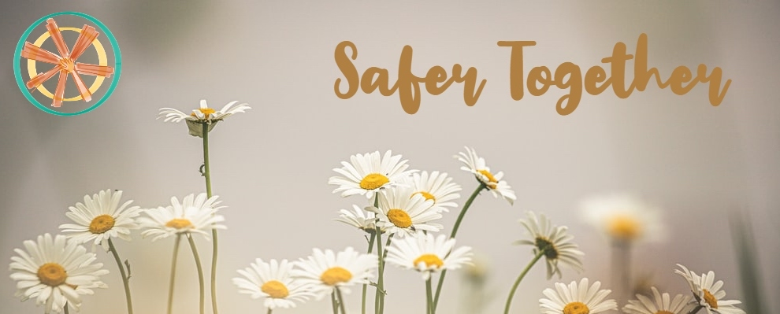

# daisy

Buddy system App Prototype for [VenusHack 2021](https://venushacks-2021.devpost.com/).

# Inpiration
We are Safer Together! Daisies are friends that live amongst you; the flower's name even translates to "day's eyes". Safer Together is a project that provides anyone, especially women, with a buddy system for navigating rural or public areas that are typically unsafe or uncomfortable for them to be alone in. Need to walk by a dangerous street or alley late at night? Need a bus buddy that goes to your school? Don't have anyone to go see that awesome concert or club with? Just moved to a new city not knowing anyone? Have a fellow daisy nearby accompany you! If you are currently in an abusive relationship and need to find a way out, our experts can help.

# What it does
It is a platform where people can sign up and find other people to be their buddies. The users are called daisies. Daisies are people of your age, people who go to your school, people who have similar hobbies and interests, people in your area, or social workers who specialize in human services. The platform has a unique system for signing up. You will need an invite from an existing daisy or a reference letter that help us in verifying you. You can join a community of your interests. There are health, family, students, early career, and many other communities. For finding the people near you, there is an integrated map that can help you.

# How we built it
We built it using HTML, CSS, BootStrap, and JavaScript.

# Challenges we ran into
Coordinating with different time zones was a little difficult, but we were able to effectively work together by pairing tasks.

# Accomplishments that we're proud of 
We were able to build a functional prototype. It has been a great weekend for all of us. We loved meeting new people and working on this project together. We were impressed by the idea when we discussed it. We could relate to it and see the need for such a platform.

# What we learned
We learned to work together for a cause. Being a woman, each one of us wanted to give our personal input and contribute to the platform. We also learned flexibility in working together remotely from different locations.

# What's next for Safer Together
We would like to add more features such as a functional map and an interactive community page. In the future, we would also love to extend it to all platforms, mobile as well as web.

